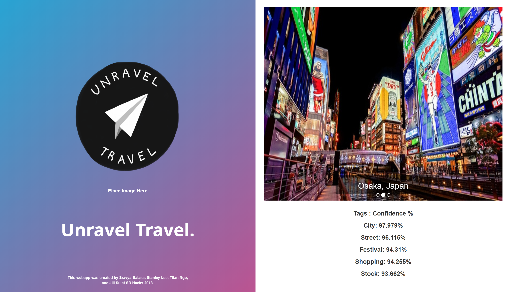

# UNRAVEL TRAVEL - SDHacks2018

Hello!
Welcome to your friendly vacation-picker. Enter our website with an online image of your favorite locale and we'll recommend to you some very similar places for your next relaxing getaway. Come on over and UNRAVEL what TRAVEL is best for you!

# Motivation
This project was created in 36 hours during a hackathon at UCSD. The team's interest in machine learning drove us to use the Clarifai API for image and video recognition. To implement a user input facility and wide range of front end and back end technologies, we developed a web application involving Python (backend) and  HTML, Bootstrap framework, CSS, JS, and flask (frontend).

# Screenshots + Video Demo

DEMO:
https://www.youtube.com/watch?v=Lhu-0-K8HQA&feature=youtu.be

# Installation + Interaction
Installation
- Create an API key through Clarifai, and insert it into the variable "myApi" in LocalHost.py
- Run the file LocalHost.py to run a local host server on your computer
- Enter "localhost:5000" in your web browser
Interaction
- Enter the image address (url) into the text area. Press 'Enter'
- Use the carousel slideshow to navigate through your three recommendations

# Features 
- Self-created dataset
- User input facility

# Challenges
- Clarifai's API methods were difficult to implement, especially in removing images/duplicates off of the server and storing variables for output
- Dealing with free, limited usage of Clarifai API
- Connecting the backend to front end using specific functions
- Inability to find a specific enough dataset and having to make our own specific one

# Extensions
- Create a website link; an established domain
- Insert more variety of images in dataset per location
- Insert more locations in the dataset
- Inputs users URL to train dataset further

# CLARIFAI - API Reference
Various Documentations:

Online Documentation:
https://clarifai.com/developer/guide/

PDF Documentation:
https://media.readthedocs.org/pdf/clarifai-python/latest/clarifai-python.pdf

Language References:
https://clarifai.com/developer/reference/

Visual Similarity:
https://blog.clarifai.com/search-images-by-visual-similarity-with-the-clarifai-api

# Credits
Visual Similarity:
https://blog.clarifai.com/search-images-by-visual-similarity-with-the-clarifai-api

Website Aesthetics:
https://codepen.io/
